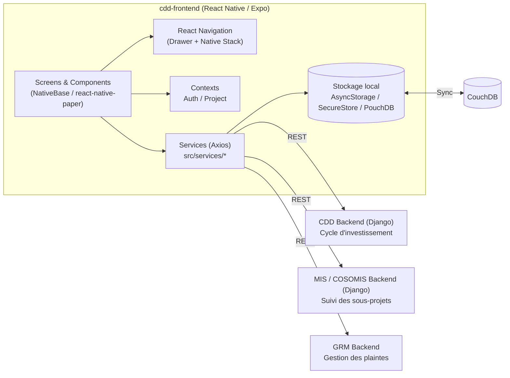

# cdd-frontend

Application mobile **React Native / Expo** du projet **CDD (Conduite de Développement Communautaire / ANADEB - Togo)**.

Elle permet aux facilitateurs de terrain, spécialistes et superviseurs de :
- suivre le **cycle d'investissement communautaire** (phases, activités, tâches) village par village ;
- planifier et déclarer leurs activités quotidiennes de terrain (module **Planning**) ;
- suivre la réalisation physique et financière des **sous-projets / infrastructures** (étapes, niveaux, pièces jointes, coordonnées GPS) ;
- consulter un **diagnostic synthétique** de la situation des activités et des sous-projets sur leur zone d'intervention ;
- consulter les **actualités** et **matériels d'appui** du projet ;
- travailler en mode déconnecté et **synchroniser** les données collectées dès qu'une connexion est disponible.

## Sommaire

- [Fonctionnalités principales](#fonctionnalités-principales)
- [Architecture technique](#architecture-technique)
- [Backends et services externes](#backends-et-services-externes)
- [Structure du projet](#structure-du-projet)
- [Flux de données et synchronisation](#flux-de-données-et-synchronisation)
- [Installation et lancement](#clone-actually-version)
- [Historique des versions](#version)

## Fonctionnalités principales

| Module | Description |
| --- | --- |
| **Authentification** | Connexion sécurisée, gestion de session (`expo-secure-store`), changement / réinitialisation de mot de passe |
| **Sélection de projet** | Un utilisateur peut intervenir sur plusieurs projets et changer de projet actif |
| **Cycle d'investissement** | Navigation Phase → Activité → Tâche, remplissage de formulaires dynamiques (`tcomb-form-native`), gestion des statuts (non démarré, en cours, terminé, validé, invalidé) |
| **Planning** | Planification et suivi journalier des activités des facilitateurs, avec historique et commentaires |
| **Suivi des sous-projets / infrastructures** | Cantons, villages, CVD, sous-projets, étapes (`Step`) et niveaux (`Level`) de réalisation, détails techniques, sociaux et des entreprises, géolocalisation, galerie de fichiers |
| **Diagnostic** | Synthèse chiffrée de l'état des activités et des infrastructures sur la zone d'intervention de l'utilisateur connecté |
| **Géolocalisation** | Prise de coordonnées GPS des villages et des infrastructures (Mapbox / Google Maps) |
| **Actualités (News)** | Consultation des actualités du projet |
| **Matériels d'appui** | Consultation et téléchargement de documents de support |
| **Synchronisation** | Synchronisation des données et pièces jointes collectées hors-ligne vers les backends distants |
| **Paramètres** | Changement de base facilitateur, changement de projet, profil, notifications |

## Architecture technique

- **Framework** : React Native (projet Expo *bare/native*, `expo run:android` / `expo run:ios`)
- **Langage** : TypeScript (+ quelques fichiers JS historiques)
- **UI** : [NativeBase](https://nativebase.io/) et [react-native-paper](https://reactnativepaper.com/) comme providers de thème / composants, `react-native-vector-icons`
- **Navigation** : [React Navigation](https://reactnavigation.org/) — pile native (`native-stack`) + menu latéral (`drawer`)
- **État global** : React Context (`AuthContext`, `ProjectContext`), pas de librairie externe type Redux
- **Formulaires dynamiques** : `tcomb-form-native` / `tcomb-json-schema` (formulaires générés depuis un schéma, utilisés notamment pour les tâches du cycle d'investissement)
- **Appels réseau** : Axios (`src/services`)
- **Stockage local** : `@react-native-async-storage/async-storage`, `expo-secure-store` (session), `expo-file-system`
- **Synchronisation hors-ligne** : CouchDB / PouchDB (`utils/pouchdb_call.js`, `utils/coucdb_call.js`, `utils/databaseManager.ts`)
- **Cartographie** : `@rnmapbox/maps` et `react-native-maps`
- **Autres** : `expo-image-picker` / `expo-image-manipulator` (photos), `expo-document-picker`, `pdf-lib` / `react-native-pdf` (documents), `expo-calendar`, `react-native-calendars`

### Vue d'ensemble



## Backends et services externes

L'application communique avec trois backends REST distincts ainsi qu'une base CouchDB, configurés via variables d'environnement (`.env` / `dev.env` / `prod.env`, lues dans `src/services/env.tsx`) :

| Variable d'environnement | Rôle |
| --- | --- |
| `EXPO_PUBLIC_CDD_BASE_URL_ENV` | Backend **CDD** : cycle d'investissement (phases, activités, tâches) |
| `EXPO_PUBLIC_MIS_BASE_URL_ENV` | Backend **MIS / COSOMIS** : suivi des sous-projets et infrastructures (`subprojects/api`) |
| `EXPO_PUBLIC_GRM_BASE_URL_ENV` | Backend **GRM** : gestion des plaintes |
| `EXPO_PUBLIC_COUCHDB_BASE_URL_ENV` | Base **CouchDB** utilisée pour la synchronisation des données collectées hors-ligne |

## Structure du projet

```
cdd-frontend/
├── App.tsx                  # Point d'entrée : providers de thème + navigation principale
├── src/
│   ├── screens/              # Un dossier par écran / module fonctionnel
│   │   ├── Home.tsx
│   │   ├── Login/
│   │   ├── Planning/
│   │   ├── Subprojects/      # Cantons, Villages, CVD, sous-projets, diagnostic, étapes...
│   │   ├── Geolocation/
│   │   ├── News/
│   │   ├── Settings/
│   │   ├── SupportMaterials/
│   │   ├── SyncDatas/
│   │   └── TaskDiagnostic/
│   ├── components/           # Composants réutilisables (formulaires, listes, viewers de fichiers...)
│   ├── contexts/              # AuthContext, ProjectContext
│   ├── navigation/
│   │   ├── main/               # Bascule Private / Public routes selon l'état de connexion
│   │   ├── private-routes/     # Drawer + écrans accessibles une fois connecté
│   │   └── public-routes/      # Login, mot de passe oublié...
│   ├── services/               # Appels API par domaine (subprojects, planning, project, news, facilitators...)
│   ├── models/                 # Types / modèles TypeScript miroir des modèles Django (Subproject, Step, Level...)
│   ├── utils/                  # Helpers (dates, permissions, géolocalisation, PouchDB/CouchDB, stockage...)
│   └── types/                  # Types partagés (navigation...)
├── android/                   # Projet natif Android (Expo bare workflow)
└── assets/                    # Images, fonds d'écran, icônes
```

## Flux de données et synchronisation

L'application peut fonctionner en environnement de terrain avec une connectivité limitée :

1. Les données saisies (formulaires de tâches, planning, progression des infrastructures, photos/documents) sont d'abord conservées localement.
2. Un module de **synchronisation** (`src/screens/SyncDatas`, `utils/databaseManager.ts`, `utils/pouchdb_call.js`) détecte l'état du réseau (`@react-native-community/netinfo`) et pousse les données en attente vers CouchDB puis, selon le domaine, vers le backend concerné (CDD, MIS, GRM).
3. Les fichiers (photos, documents) sont compressés (`expo-image-manipulator`) avant envoi pour limiter la consommation de données.

## Clone actually version
`git clone -b develop https://github.com/anadeb-coso/cdd-frontend.git`

# Install and run the app
1. Install a version greater than or equal to [JDK](https://www.oracle.com/java/technologies/javase/jdk17-archive-downloads.html) 17
2. Install a version greater than or equal to [node](https://nodejs.org/fr/blog/release/v20.16.0) 20.16.0
3. Install Android Studio, VSCode or another editor you like (Recommendation : [Android Studio](https://developer.android.com/studio))
4. run `yarn install` to install the dependencies on the package.json file
5. run `yarn android` to run your app on your PC
6. Generate APK for test : `yarn android --mode release` or `.\gradlew assembleRelease`
7. Generate AAB for deployment : `npx react-native build-android --mode=release`. To see the file generated : `android/app/build/outputs/apk/release`

## Version
    - 17 (1.7.1)
        - Fix nullable problem on tache (id-19-Vérification de l'existence du CVD et de ses organes)
    - 18 (1.7.2)
        - Set server endpoint to "http://52.52.147.181/"
    - 19 (1.7.3)
        - Set server endpoint to "https://cddanadeb.e3grm.org/"
    - 20 (1.8.2) - 2023.07.27
        - Integration of task diagnostics and status
    - 21 (1.8.4) - 2023.07.27
        - Display CVD name on Phase, activty and task details page And update tasks search feature
    - 22 (1.8.5) - 2023.07.27
        - Update tasks search feature
    - 23 (1.8.6) - 2023.07.27
        - Update tasks search feature
    - 24 (1.9.0) - 2023.08.03
        - Setup a feature to sync falicilitator form datas to the couchdb
    - 25 (2.0.0) - 2024.01.29
        - Setup features to tracking subprojects, to allowing specialists to connect to the app for tracking subprojects and to allowing users to download apps
    - 26 (2.1.0) - 2024.02.23
        - Setup Support Material features
        - Updated fix map page closing problem
        - Updated some tracking subprojects pages
        - Decreased Images file during the loading
        - Fixed BigInt Bug
    - 28 (2.4.0) - 2024.04.24
        - Implementation of a sub-project tracking sub-module to record infrastructure details
        - Integration of a geographic coordinates module for villages and locations
        - Update of the sub-project tracking geographic coordinates page to allow the user to select the coordinates of pre-registered locations.
        - Small updates to sub-project tracking and other pages
    - 29 (2.4.1) - 2024.04.24
        - Add alert message to geolocation taking page (Message: Please make sure you are in the location before clicking on the location button.)
    - 30 (3.0.0) - 2024.08.07
        - Add Planning Feature
        - Check network availability before sync attachment on CDD cycle task form
        - Compress Image before upload attachment
        - Remove fences and latrine blocks questions and add latrine blocks numbers question under latrine blocks structure type
        - *Cancel local data storage and link the application directly to the remote database*
    - 31 (4.0.0) - 2024.08.08
        - Updated Expo project to Native project and adapted some files to the update
        - Add village progess to the project cycle page
        - Fix the display progress percent on the villages page
    - 32 (4.0.1) - 2024.08.11
        - Fix unsearching previous task
    - 33 (4.1.1) - 2024.09.02
        - Added News feature
    - 34 (4.7.1) - 2024.09.20
        - Fix and Update News feature
        - Update Instissment Cycle pages
        - Updated planning feature using Django Model instead of CouchDB doc
        - Include the possibility of using multiple Projects
    - 35 4.8.1 :
        - Set up possibility to use the database of another facilitator
        - Update planning feature to allow to Specialist to use it
        - Possibility to switch to another project
        - Page infos
    - 36 4.9.0 :
        - Precise number of invalidated tasks for villages, phases and activities
        - Status display (not started, in progress, completed, in validation, validated and invalidated) on tasks
        - Reduced image compression for clearer downloads
        - Changed GIS URL base
        - Filtering of CA tasks during diagnostics in the “Vos taches" module
    - 37 4.9.1 :
        - Resolving form registration problems
    - 38 4.9.9 :
        - Fix the displaying projects during the login
        - Add possibility to define dates interval
        - Add task example form
        - Alert users to activate their localization when taking coordinates (when they haven't yet activated localization)
    - 39 5.0.0 :
        - Added functionality for facilitators to report their presence in the field and collect coordinates of activity locations
        - Correction of file synchronization problems when recording site progress levels
        - Improved photo quality
    - 40 5.0.9 : 2025.02.10
        - Add passord changing and reset process
        - Increase user position around of initial position during the activity confirmation
        - Implementation of a constraint requiring the confirmation of the activity only for the relevant date.
    - 41 5.3.0 : 2025.04.05
        - Split data from multiple facilitators on each screen
        - Management of data retrieval processes on the server to avoid an infinite loop
    - 42 5.4.0 : 2025.04.20
        - Change field display and modalize selection fields
        - File selection restrictions depending on the file to be loaded
        - Delete test data from memory after test (TaskDetailTest)
        - Adding optional options to files/photos
        - Changes some warning Toasts to Modals
    - 43 5.5.0 : 2025.04.25
        - Navigation prevented when the application is out of date.
        - Update `tcomb-form-native` package
            - Updated use of modal elements by changing 'Picker' to 'Modal' react-native for Android version (Calendar display for dates)
            - Added ability to style Picker modal elements for IOS version 
            - Updated DatetimePicker to use 'react-native-modal-datetime-picker' datetime for Android
            - Updated text box to apply spaces when entering numbers
            - Customized display of multiline text entries
    - 44 5.5.2 : 2025.06.28
        - Copy the cantonal data common to all villages in a canton to the other villages belonging to the same canton
    - 45 5.6.0 : 2025.10.19
        - Integrate attendance number fields into planning
        - Highlight the difference between the labels of the main work and the secondary works
        - Provide the ability to log out on the project selection page
        - Reducing data to save in history
        - Displaying the application version in the Drawer
    - 46 5.6.1 : 2025.10.21
        - Accepting 0 in attendance fields in scheduling
    - 47 5.6.2 : 2025.10.22
        - Error saving task form
    - 48 5.7.0 : 2025.11.27
        - Review of geographic coordinate retrieval by finding the best location and resolving problems encountered during coordinate retrieval
        - Fixing issues with displaying AC villages in the "Village Geolocation" section
        - Display of tasks invalidated and reviewed by the facilitator
        - The retrieval of DCC data from facilitators db has been made smoother
        - To control and ensure user connectivity before certain requests are launched
        - Resolution of the problem of certain activities (planning) not being recorded when the user does not fill in the description field
        - Resolve the problem of priorities not being recorded in relation to the sub-project
    - 49 5.7.1 : 2026.01.25
        - Delete / download / view files directly from the mobile app (DCC form)
        - Change subdomain "cosomis-2.eba-mxictqba.us-west-1.elasticbeanstalk.com" to "sig.coso-togo.com" to apply secure https option
        - Change subdomain "cdd-env.eba-mz2nppu7.us-west-1.elasticbeanstalk.com" to "dcc.coso-togo.com" to apply secure https option
        - Change subdomain "grm-2-env.eba-speiyafz.us-west-1.elasticbeanstalk.com" to "mgp.coso-togo.com" to apply secure https option
    - 50 5.9.1 : 2026.02.06
        - Corrected TypeScript syntax and restructured the code
        - Displayed, zoomed, downloaded, and deleted files/photos from DCC cycle tasks
        - Displayed, zoomed, and downloaded files/photos from infrastructure data
        - Added the ability to select multiple photos of an infrastructure for synchronization
        - Reviewed the homepage
        - Review of the layout of the support materials page
    - 51 5.9.2 : 2026.03.04
        - Fixed the issue of PDF files not displaying in the gallery via the file field
    - 52 5.9.7 : 2026.05.06
        - Adapt the scheduling confirmation button (in the Scheduling module) to allow certain mobile phones to display this button
        - Restricting users' rights to actions on tracking progress levels, taking photos, deleting photos, taking geographic coordinates and entering data concerning the details of an infrastructure
        - Display of validation and invalidation comments on files (photos, documents) of the infrastructures with mention with colours on the files indicating whether they are validated or not, or which is the main file
    - 53 5.9.8 : 2026.05.13
        - Display under each canton, village, CVD, sub-project and work, the number of files (photos+documents) taken with invalid number
        - Using MAPBOX to display the coordinate point of an infrastructure under the "Geolocation" module
    - 54 6.0.0 : 2026.06.05
        - Add the ability to specify the work environment for a planned activity
        - Rebuild and revitalize the monitoring steps of the structures/sub-projects
        - Split the "More Details" sub-module of the structures/sub-projects into three parts: Technical and Company Details, Détails audit social, and More Details
    - 55 6.0.1 : 2026.06.19
        - Review of image resizing during downloads
    - 55 6.1.0 : 2026.07.17
        - Review the display of the facilitator database to show the database of the connected facilitator even if they are no longer stable in the area of ​​the previous project
        - Allow the geolocation status to be updated upon registration
        - Fixed functional anomalies with the screen cursor during data entry
        - Added the ability to zoom maps with your fingers
        - Make the field for the total amount spent an optional step
        - Implement the subproject diagnostic module
    - 56 6.1.1 : 2026.08.06
        - Removed the direct call to the shared CouchDB "eadls" database (now migrated to Postgres on the GRM side) and replaced it with a new CDD backend proxy endpoint to fetch a facilitator's administrative zones (ADL)
        - Adjusted the minimum valid image size threshold used before reading attachment dimensions (task, planning and news attachments)
        - Improved the visual display of section titles and anomaly tiles on the subproject diagnostic page

# Integrate with your tools

- [ ] [Set up project integrations](https://gitlab.com/ecube3/cdd-frontend/-/settings/integrations)

# Collaborate with your team

- [ ] [Invite team members and collaborators](https://docs.gitlab.com/ee/user/project/members/)
- [ ] [Create a new merge request](https://docs.gitlab.com/ee/user/project/merge_requests/creating_merge_requests.html)
- [ ] [Automatically close issues from merge requests](https://docs.gitlab.com/ee/user/project/issues/managing_issues.html#closing-issues-automatically)
- [ ] [Enable merge request approvals](https://docs.gitlab.com/ee/user/project/merge_requests/approvals/)
- [ ] [Automatically merge when pipeline succeeds](https://docs.gitlab.com/ee/user/project/merge_requests/merge_when_pipeline_succeeds.html)

# Test and Deploy

Use the built-in continuous integration in GitLab.

- [ ] [Get started with GitLab CI/CD](https://docs.gitlab.com/ee/ci/quick_start/index.html)
- [ ] [Analyze your code for known vulnerabilities with Static Application Security Testing(SAST)](https://docs.gitlab.com/ee/user/application_security/sast/)
- [ ] [Deploy to Kubernetes, Amazon EC2, or Amazon ECS using Auto Deploy](https://docs.gitlab.com/ee/topics/autodevops/requirements.html)
- [ ] [Use pull-based deployments for improved Kubernetes management](https://docs.gitlab.com/ee/user/clusters/agent/)
- [ ] [Set up protected environments](https://docs.gitlab.com/ee/ci/environments/protected_environments.html)

***
